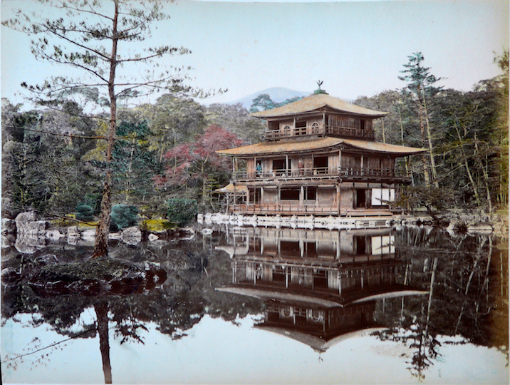
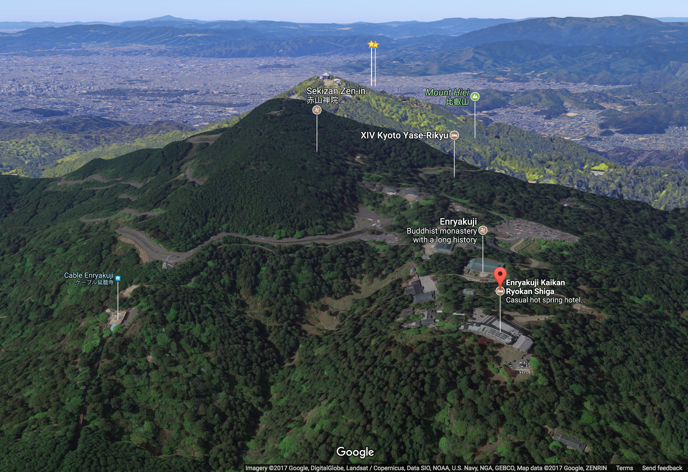

## 京都

- Ruby: [京](きょう)[都](と)

Old Imperial capital of Japan.

## 平等院

- Ruby: [平](びょう)[等](どう)[院](いん)

A Buddhist temple in the city of Uji in Kyoto Prefecture. It is jointly a temple of the Jōdo-shū and Tendai-shū sects.

Originally built in 998 as a rural villa of high-ranking courtier Minamoto no Shigenobu, it was purchased by Fujiwara no Michinaga after its original owner’s death. The villa was made into a Buddhist temple by Fujiwara no Yorimichi in 1052. The most famous building in the temple is [鳳凰堂](#鳳凰堂), constructed in 1053. It is the only remaining original building, surrounded by a scenic pond; additional buildings making up the compound were burnt down in 1336, during the crisis surrounding the Kenmu Restoration and the rise of the [足利幕府](#足利幕府).

[Official website](http://www.byodoin.or.jp/en/index.html)

](byoudouin-montage.jpg)

## 鳳凰堂

- Ruby: [鳳](ほう)[凰](おう)[堂](どう)

Only surviving Heian building at [平等院](#平等院), constructed in 1053.

](Byodo-in_in_Uji.jpg)

## 銀閣寺

- Ruby: [銀](ぎん)[閣](かく)[寺](じ)

A temple in the Sakyo ward of Kyoto, Japan, today associated with the Shōkoku-ji branch of Rinzai Zen. Officially named [慈](じ)[照](しょう)[寺](じ), it was designed by Ashikaga Yoshimasa (義政) to be his retirement villa who planned to have it converted to a Zen temple after his death. Construction began in 1482, though [応仁の乱](#応仁の乱) delayed its completion. Having retired to the villa, it is said Yoshimasa sat in the pavilion, contemplating the calm and beauty of the gardens as the 応仁の乱 worsened and Kyoto was burned to the ground. They say it represents the [東山](#東山) Culture of the 室町 period.

](shoukokuji-gin.png)

## 大文字山

- Ruby: [大](だい)[文](もん)[字](じ)[山](やま)

The most famous mountain upon which the bonfires of [五山送り火](#五山送り火) are lit.

](Gozanokuribi_Daimonji2.jpg)

![Kyoto [texshade][Kyoto texshade] with Bing aerial basemap](kyoto-texshade.png)

## 五山送り火

- Ruby: [五](ご)[山](ざん)[送](おく)り[火](び)

More commonly simply [大文字](#大文字), the culmination of Obon festival involving several huge bonfires on the mountainsides around [京都](#京都).

](gozantop.gif)

## 東山

- Ruby: [東](ひがし)[山](やま)

One of the eleven wards of Kyoto City, known for its historic preserved architecture.

](At_Yasakakamimachi_Kyoto_Japan01n.jpg)

## 応仁の乱

- Ruby: [応](おお)[仁](にん)の[乱](らん)

A civil war that lasted from 1467 to 1477 that initiated, with the collapse of the 足利幕府, the Sengoku period. It is named after the era that it started in.

## 足利幕府

- Ruby: [足](あし)[利](かが)[幕](ばく)[府](ふ)

The shogunate successor of the Kamakura Bakufu, founded by Ashikaga Takauji (尊氏) who wrested control of the state from the Houjou clan.

](Ashikaga_mon.svg)

## 室町

- Ruby: [室](むろ)[町](まち)

The period name of the 足利幕府, named after the street where the third shogun, Ashikaga Yoshimitsu (義満), established his residence in 1379. 室町幕府 is also appropriate.

## 金閣寺

- Ruby: [金](きん)[閣](かく)[寺](じ)

Officially [鹿](ろく)[苑](おん)[寺](じ),  a temple in Kita-ku ward that was bought by Ashikaga Yoshimitsu (義満), grandfather of Yoshimasa (義政), and belonging to the Shōkoku-ji school of Rinzai Zen. It is the only building in its temple complex to survive the [応仁の乱](#応仁の乱).

](shoukokuji-kin.png)

(In the above map, note the 大 represents [左大文字山](#左大文字山), on the western side of Kyoto, not the one next to [銀閣寺](#銀閣寺)!)

## 左大文字山

- Ruby: [左](ひだり)[大](だい)[文](もん)[字](じ)[山](さん)

Another mountain with a 大 bonfire for [五山送り火](#五山送り火), to the west of northern [京都](#京都).

](HidariDaimonji.jpg)

![Kyoto [texshade][Kyoto texshade] with Bing aerial basemap](kyoto-texshade.png)

## 上賀茂神社

- Ruby: [上](かみ)[賀](が)[茂](も)[神](じん)[社](じゃ)

A key shrine on the banks of [鴨川](#鴨川) in north [京都](#京都), first founded in 678, dedicated to [賀](か)[茂](も)[別](わけ)[雷](いかづち), the thunder kami. It is the topic of John K Nelson’s *Enduring Identities: The Guise of Shinto in Contemporary Japan* (2000).

## 下鴨神社

- Ruby [下](しも)[鴨](がも)[神](じん)[社](じゃ)

A key shrine just north of where the [鴨川](#鴨川) meets the [高野川](#高野川), beleived to be founded in the sixth century, before [京都](#京都) became the imperial capital. It is dedicated to [玉](たま)[依](より)[姫](ひめ), mother of [賀](か)[茂](も)[別](わけ)[雷](いかづち) (who has his own shrine dedicated to him, [上賀茂神社](#上賀茂神社)), and her father, [賀](か)[茂](も)[建](たけ)[角](つの)[身](み).

## 鴨川

- Ruby: [鴨](かも)[川](がわ)

The river whose course was altered to flow to the east of the imperial palace when [京都](#京都) became the imperial capital. [白](しら)[河](かわ)[天](てん)[皇](のう) said the three things he couldn’t control were: monk-soldiers of [延暦寺](#延暦寺), rolls of dice, and waters of 鴨川.

## 高野川

- Ruby: [高](たか)[野](の)[川](がわ)

The other river of northern [京都](#京都).

## 延暦寺

- Ruby: [延](えん)[暦](りゃく)[寺](じ)

The monastery founded by [最](さい)[澄](ちょう) on [比叡山](#比叡山) in 788, as directed by [桓](かん)[武](む)[天](てん)[皇](のう), who founded [京都](#京都), to guard his city from the evil northeast direction. A Tendai monastery, its monk-soldiers caused tremendous grief for other monasteries, as well as emperors, shoguns, and daimyo, until Oda Nobunaga razed the complex in 1571 (though of course there’s that *one* building that survived).

[法](ほう)[然](ねん) (founder of Japanese Pure Land Buddhism), [日](にち)[蓮](れん) (the Lotus Sutra guy), and [親](しん)[鸞](らん) (founder of *True* Pure Land Buddhism) all studied here.

](enryakuji-map.jpg)

It’s technically in 大塚, in Shiga Prefecture.

## 比叡山

- Ruby: [比](ひ)[叡](えい)[山](ざん)

The tallest mountain northeast of [京都](#京都), near the peak of which sits [延暦寺](#延暦寺).

](Sakura_MtHiei.jpg)

## References

[Kyoto texshade]: http://maps.aldebrn.me/Apps/#%7B%22version%22%3A0%2C%22baseLayerPicked%22%3A%7B%22name%22%3A%22Bing%20Maps%20Aerial%20with%20Labels%22%2C%22iconUrl%22%3A%22http%3A%2F%2Fmaps.aldebrn.me%2FBuild%2FCesium%2FWidgets%2FImages%2FImageryProviders%2FbingAerialLabels.png%22%7D%2C%22baseTerrainPicked%22%3A%7B%22name%22%3A%22WGS84%20Ellipsoid%22%7D%2C%22layers%22%3A%5B%7B%22url%22%3A%22%2F%2Fdev.virtualearth.net%22%2C%22isBaseLayer%22%3Atrue%2C%22alpha%22%3A1%2C%22brightness%22%3A1%2C%22contrast%22%3A1%2C%22hue%22%3A0%2C%22saturation%22%3A1%2C%22gamma%22%3A1.3%7D%2C%7B%22url%22%3A%22http%3A%2F%2Fmaps.aldebrn.me%2Fworld-tex-cgiar-90m%22%2C%22isBaseLayer%22%3Afalse%2C%22alpha%22%3A0.62%2C%22brightness%22%3A1.32%2C%22contrast%22%3A1.4%2C%22hue%22%3A0%2C%22saturation%22%3A1%2C%22gamma%22%3A1%7D%5D%2C%22terrainExaggeration%22%3A1%2C%22destination%22%3A%7B%22x%22%3A-3786181.378980977%2C%22y%22%3A3689859.397735441%2C%22z%22%3A3671115.2990479674%7D%2C%22orientation%22%3A%7B%22heading%22%3A0.0014865895153031161%2C%22pitch%22%3A-1.5707091488187594%2C%22roll%22%3A0%7D%7D
