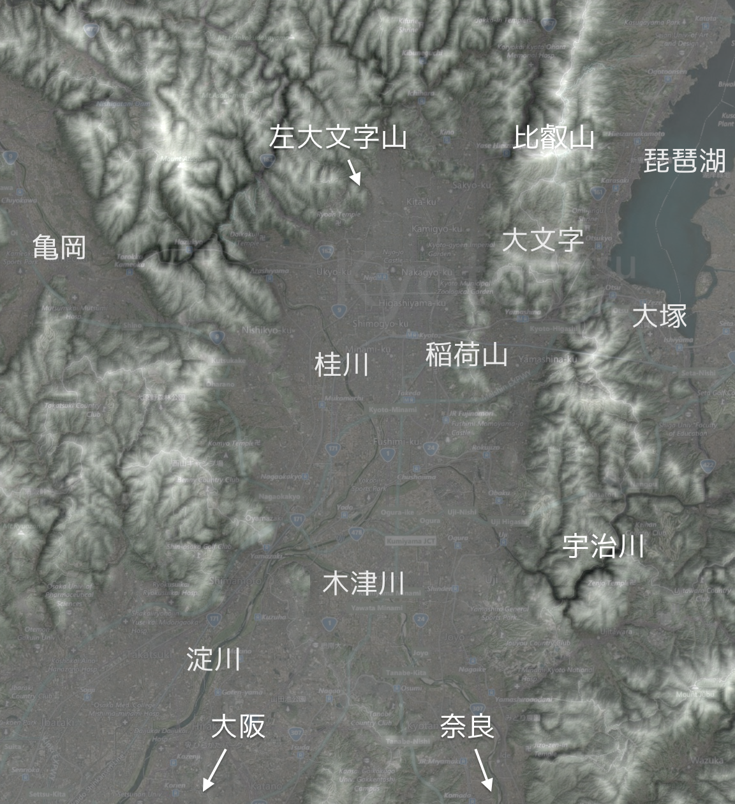
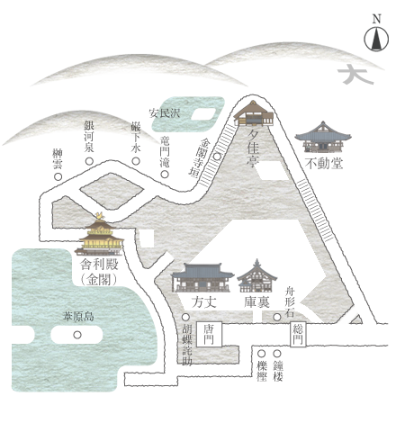
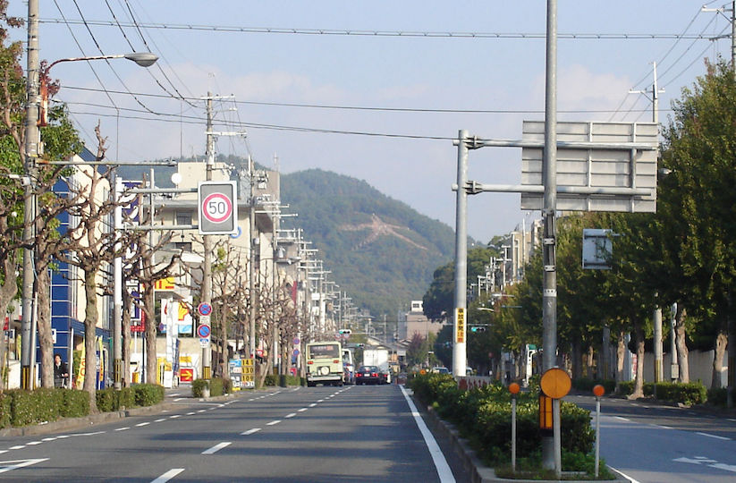

# 平等院

- [平](びょう)[等](どう)[院](いん)

A Buddhist temple in the city of Uji in Kyoto Prefecture. It is jointly a temple of the Jōdo-shū and Tendai-shū sects.

Originally built in 998 as a rural villa of high-ranking courtier Minamoto no Shigenobu, it was purchased by Fujiwara no Michinaga after its original owner’s death. The villa was made into a Buddhist temple by Fujiwara no Yorimichi in 1052. The most famous building in the temple is the Phoenix Hall ([鳳凰堂](#鳳凰堂) Hōō-dō), constructed in 1053. It is the only remaining original building, surrounded by a scenic pond; additional buildings making up the compound were burnt down during a civil war in 1336.

[Official website](http://www.byodoin.or.jp/en/index.html)

](byoudouin-montage.jpg)

# 鳳凰堂

- [鳳](ほう)[凰](おう)[堂](どう)

Only surviving Heian building at [平等院](#平等院), constructed in 1053.

](Byodo-in_in_Uji.jpg)

# 銀閣寺

- [銀](ぎん)[閣](かく)[寺](じ)

A temple in the Sakyo ward of Kyoto, Japan, today associated with the Shōkoku-ji branch of Rinzai Zen. Officially named [慈](じ)[照](しょう)[寺](じ), it was designed by Ashikaga Yoshimasa (義政) to be his retirement villa who planned to have it converted to a Zen temple after his death. Construction began in 1482, though [応仁の乱](#応仁の乱) delayed its completion. Having retired to the villa, it is said Yoshimasa sat in the pavilion, contemplating the calm and beauty of the gardens as the 応仁の乱 worsened and Kyoto was burned to the ground. They say it represents the [東山](#東山) Culture of the 室町 period.

# 大文字山

- [大](だい)[文](もん)[字](じ)[山](やま)

The most famous mountain upon which the bonfires of [五山送り火](https://en.wikipedia.org/wiki/Gozan_no_Okuribi) are lit.

](Gozanokuribi_Daimonji2.jpg)

# 東山

- [東](ひがし)[山](やま)

One of the eleven wards of Kyoto City, known for its historic preserved architecture.

](At_Yasakakamimachi_Kyoto_Japan01n.jpg)

# 応仁の乱

- [応](おお)[仁](にん)の[乱](らん)

A civil war that lasted from 1467 to 1477 that initiated, with the collapse of the 足利幕府, the Sengoku period. It is named after the era that it started in.
 
# 足利幕府

- [足](あし)[利](かが)[幕](ばく)[府](ふ)

The shogunate successor of the Kamakura Bakufu, founded by Ashikaga Takauji (尊氏) who wrested control of the state from the Houjou clan.

](Ashikaga_mon.svg)

# 室町

- [室](むろ)[町](まち)

The period name of the 足利幕府, named after the street where the third shogun, Ashikaga Yoshimitsu (義満), established his residence in 1379. 室町幕府 is also appropriate.

# 金閣寺

- [金](きん)[閣](かく)[寺](じ)

Officially [鹿](ろく)[苑](おん)[寺](じ),  a temple in Kuta-ku ward that was bought by Ashikaga Yoshimitsu (義満), grandfather of Yoshimasa (義政), and belonging to the Shōkoku-ji school of Rinzai Zen. It alone survived the 

(In the above map, note the 大 represents [左大文字山](#左大文字山), on the western side of Kyoto, not the one next to [金閣寺](#金閣寺)!)

# 左大文字山

- [左](ひだり)[大](だい)[文](もん)[字](じ)[山](さん)

Another mountain with a 大 bonfire for [五山送り火](https://en.wikipedia.org/wiki/Gozan_no_Okuribi).

# References

[Kyoto texshade]: http://maps.aldebrn.me/Apps/#%7B%22version%22%3A0%2C%22baseLayerPicked%22%3A%7B%22name%22%3A%22Bing%20Maps%20Aerial%20with%20Labels%22%2C%22iconUrl%22%3A%22http%3A%2F%2Fmaps.aldebrn.me%2FBuild%2FCesium%2FWidgets%2FImages%2FImageryProviders%2FbingAerialLabels.png%22%7D%2C%22baseTerrainPicked%22%3A%7B%22name%22%3A%22WGS84%20Ellipsoid%22%7D%2C%22layers%22%3A%5B%7B%22url%22%3A%22%2F%2Fdev.virtualearth.net%22%2C%22isBaseLayer%22%3Atrue%2C%22alpha%22%3A1%2C%22brightness%22%3A1%2C%22contrast%22%3A1%2C%22hue%22%3A0%2C%22saturation%22%3A1%2C%22gamma%22%3A1.3%7D%2C%7B%22url%22%3A%22http%3A%2F%2Fmaps.aldebrn.me%2Fworld-tex-cgiar-90m%22%2C%22isBaseLayer%22%3Afalse%2C%22alpha%22%3A0.62%2C%22brightness%22%3A1.32%2C%22contrast%22%3A1.4%2C%22hue%22%3A0%2C%22saturation%22%3A1%2C%22gamma%22%3A1%7D%5D%2C%22terrainExaggeration%22%3A1%2C%22destination%22%3A%7B%22x%22%3A-3786181.378980977%2C%22y%22%3A3689859.397735441%2C%22z%22%3A3671115.2990479674%7D%2C%22orientation%22%3A%7B%22heading%22%3A0.0014865895153031161%2C%22pitch%22%3A-1.5707091488187594%2C%22roll%22%3A0%7D%7D
